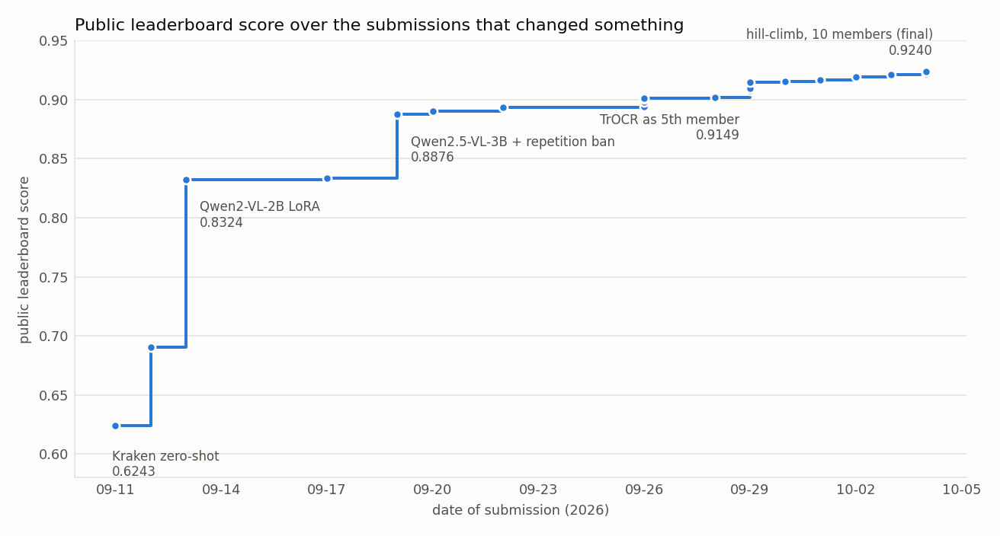

# R.O.A.D. Barbados Historic Handwriting Challenge: final solution

**Public leaderboard 0.923964** (lower-is-better objective `0.5 * weighted WER + 0.5 * weighted CER`, shown on the board as `1 - combined`).
Decoded WER 0.1133, CER 0.0387.

The submitted file is a **hill-climbing reranker over the transcriptions of ten recognizers**: seven Qwen vision-language models, two TrOCR-large models and a PP-OCRv6 recognizer. For each test line it picks one member's own reading, scored by a weighted sum of the leaderboard line cost against all members, a TrOCR likelihood and a character language model. Weights are fitted on 818 held-out training lines, never on test.



<iframe
  src="docs/demo.html"
  title="R.O.A.D. Barbados solution walkthrough"
  width="100%"
  height="900"
  loading="lazy"
  style="border: 1px solid #c9c8c2; border-radius: 6px;"
>
  <a href="https://github.com/dronny111/road-barbados-final-solution/blob/main/docs/demo.html">Open the interactive solution walkthrough.</a>
</iframe>

If the embed is unavailable in your Markdown renderer, open [the visual walkthrough](https://github.com/dronny111/road-barbados-final-solution/blob/main/docs/demo.html).

## What is in this repository

```
docs/demo.html                           visual walkthrough (pipeline, reranker, charts); open it in a browser
configs/final_ensemble.json              member order, file roles and the fitted weights
baselines/                               per-member Kaggle/Colab configs (notebooks are rebuilt, see baselines/README.md)
scripts/                                 folds, training, inference, pseudo-labels, voting, reranking, checks
src/road_ocr/                            metric, line loading, LoRA scopes, TrOCR model, character LM, recipe pieces
tests/                                   unit tests for the kept code
requirements/                            one file per environment (Kaggle training, local scoring, cleaning, PP-OCRv6)
```

## Quick start

```bash
pip install -r requirements/local-scoring.txt
make test                                   # unit tests
# put Train.csv, Test.csv, SampleSubmission.csv and images/ in the repository root, then:
make preflight && make folds                # data audit; the fold manifest must match FOLD_SHA256
make final-ensemble DRY=1                   # the commands that rebuild it from the ten members' predictions
# after rebuilding the members and final CSV:
make verify-submission                      # checksum and format of the rebuilt submission
```

Rebuilding the members takes about 50 T4-hours plus Colab time for PP-OCRv6; see `docs/REPRODUCE.md` for the
order, which matters because several members are trained on pseudo-labels produced by earlier ones.

## Results at a glance

| Model or stage | Fold-0 combined error | Public LB |
|---|---|---|
| Qwen2-VL-2B LoRA (first big jump) | 0.1746 | 0.83236 |
| + vision-encoder MLP in the LoRA scope | 0.1144 | |
| Best single models: soft-KD 2B | 0.1055 | 0.9049 (fold-0 student), 0.9067 (distilled full-data twin) |
| MBR vote of 7 members + TrOCR likelihood rescore | 0.0851 | 0.92171 |
| **Hill-climb over 10 members (submitted)** | **0.0829 (cross-validated)** | **0.92396** |

Fold-0 numbers come from one fold of 818 lines and ranked the leaderboard unreliably (SOLUTION.md section 3).

## Compliance

Only the provided data and openly licensed pretrained models were used (Qwen2.5-VL-7B, Qwen3-VL-4B, Qwen2-VL-2B,
the Kansallisarkisto multicentury TrOCR, PP-OCRv6 medium). No manual labelling or editing of predictions, no
hidden labels, no leaderboard probing. Pseudo-labels are code-generated from test predictions, which the
organizers confirmed is allowed. The Qwen2-VL-2B model card's licence was not verified against the organizers'
list. See `docs/COMPETITION.md` and SOLUTION.md section 9.
