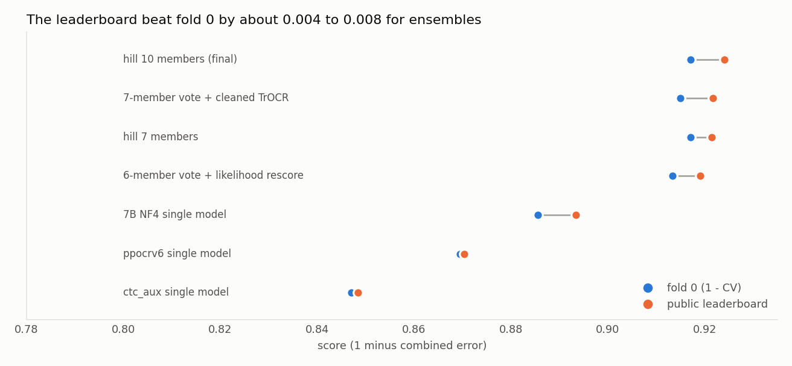
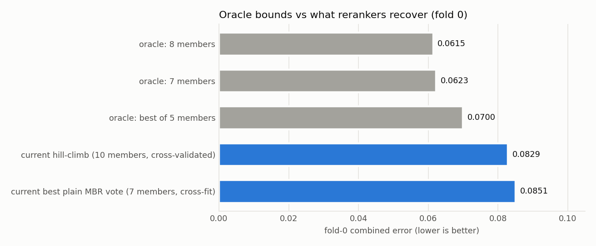

# Solution write-up: R.O.A.D. Barbados Historic Handwriting Challenge

**Public leaderboard 0.923964** (WER weighted 1.360070, CER weighted 2.130295; decoded WER 0.1133, CER 0.0387). The private score and the final rank are not known to me, and I do not claim a top-5 finish: on 2026-09-25 the public leaderboard's first place stood at 0.935147 and fifth at 0.932322, above where this solution ended.

A note on how to read the numbers. Every figure below is tagged **(measured)** when it comes from a run recorded in `docs/results/` or the registry, **(estimate)** when it is derived or inferred, and **(hypothesis)** when it is an explanation I did not test. Almost all validation evidence is a single fold of 818 lines, and I say so wherever it matters, because it turned out to matter a lot.

## 1. TL;DR

- The final file is a **hill-climbing reranker over the transcriptions of ten models**. For each of the 1,374 test lines it picks one model's own reading, scored by a weighted sum of (a) the leaderboard line cost against every member's reading, (b) the teacher-forced negative log-likelihood of the candidate under a TrOCR model, and (c) a character language-model score. It never writes new text.
- The ten members are seven Qwen vision-language models (the 7B in two forms, the 4B, and four 2B variants), two TrOCR-large models (one already fine-tuned on 913,000 historical lines, and a twin trained on cleaned images), and a PP-OCRv6 medium recognizer. My best single models scored about 0.907 on the public board; the ensemble scored 0.924.
- The biggest single steps were, in order: a larger backbone (2B to 3B, 0.062 combined error on fold 0), **adapting the vision encoder's MLP with LoRA** (0.060), and the whole **voting and reranking chain** (+0.026 on the leaderboard, 0.8934 to 0.9240).
- The most useful ensemble member was the *weakest* one. A TrOCR model scoring 0.1508 on fold 0 by itself added +0.0056 to the leaderboard when it joined the vote, the largest gain I measured from adding one member to a vote (PP-OCRv6 at 0.1305 alone added +0.0003). My explanation is that its errors are the least correlated with the VLMs' **(hypothesis)**.
- The most important lesson is about validation. Differences of about 0.001 on fold 0 did not rank leaderboard outcomes, in either direction, repeatedly. Section 3 shows the evidence.


## 2. The task and the metric

The task is to transcribe cropped single-line images of 18th and 19th century archival handwriting from Barbados. The submission is `ID,Target`.

**Data (measured).** 4,098 training lines, 1,374 test lines, 5,472 JPEGs. Widths run from 267 to 6,051 px (median 1,119), heights from 28 to 1,131 px (median 65). Training labels are 37 to 120 characters (median 62), and 4,086 are unique. A crop at least 150 px tall is a "loose" crop, usually with neighbouring lines intruding; they are about 25% of both train and test. On the 3B model's folds, loose crops were 26.5% of rows but carried 48.2% of character edits (CER 0.2098 against 0.0721 for tight crops).

**Metric.** The official objective is `0.5 * weighted WER + 0.5 * weighted CER`, lower is better. The leaderboard shows `score = 1 - 0.5 * (WER_w / 12 + CER_w / 55)`, which I decoded from several submissions to about 1e-9 and which reproduces the final score exactly: 1 - 0.5 * (0.113339 + 0.038733) = 0.923964 **(estimate: inferred, not confirmed by an organizer scorer)**. The starter evaluator in the download uses a conflicting 0.7 CER / 0.3 WER blend and imports scorer files that are missing, so I did not trust it. `src/road_ocr/metrics.py` computes the corpus-level (micro) version, and every offline number below uses it.

## 3. Validation, and why it misled me

**Scheme.** `data/splits/folds.csv` is a deterministic 5-fold manifest (`scripts/make_folds.py`, seed 20260906) with exact duplicate label text kept in one fold and the folds balanced by characters. The manifest is pinned by `FOLD_SHA256` in `src/road_ocr/trocr_support.py` (`make folds` verifies it), and every notebook refuses to run if it changes. Fold sizes are 818, 819, 818, 823 and 820.

**Why fold 0 only.** A fold-0 run of one member costs 1 to 9 T4 hours, and I had a weekly GPU quota of 30 hours. Fold 0 was the anchor and every ablation was compared on its 818 lines. Folds 1 and 2 confirmed the 3B once (combined 0.1123, 0.1180, 0.1143).

**The two sources of optimism.**
1. Vote weights, the likelihood-rescore weight and the hill-climb weights were all fitted on the same 818 lines. I mitigated this with two-half cross-fitting and paired bootstraps (2,000 resamples, seed 20260929), but the selection effect is still there.
2. The test side uses full-data models for some members, while their fold-0 twins are weaker.

**CV against the leaderboard (measured).**

| Submission | Fold-0 CV (combined) | Public LB | Gap (1 - LB) - CV |
|---|---|---|---|
| ctc_aux single model | 0.1529 | 0.8484 | -0.001 |
| PP-OCRv6 single model | 0.1305 | 0.8703 | -0.001 |
| 7B NF4 single model | 0.1144 | 0.8934 | -0.008 |
| 6-member vote + likelihood rescore | 0.0867 | 0.9191 | -0.006 |
| hill-climb, 7 members | 0.0830 | 0.9214 | -0.004 |
| 7-member vote + cleaned TrOCR | 0.0851 | 0.9217 | -0.007 |
| hill-climb, 10 members (final) | 0.0829 | 0.9240 | -0.007 |



The leaderboard beat fold 0 by roughly 0.004 to 0.008 for ensembles. That is partly the full-data members and partly an easier test set, and I could not separate the two.

**Fold-0 differences did not rank the leaderboard (measured).** Concrete cases:
- The hill-climb over seven members had the better fold-0 CV (0.0830 against 0.0851) and scored *lower* on the leaderboard than the 7-member vote (0.9214 against 0.9217).
- Adding a PP-OCRv6 member was predicted to gain +0.0036 and delivered +0.0003.
- A recipe-trained 2B member, added to the best vote, was predicted to gain +0.0012 and lost 0.0027 (0.919045).
- A hill-climb over eight members had a better CV than the 7-member vote (0.0838) and tied it on the leaderboard (0.92165 against 0.92171).
- The final ten-member hill-climb had a fold-0 CV of 0.0829 against 0.0851 for the 7-member vote (a predicted gain of 0.0022) and delivered +0.00225 on the leaderboard over it. That is the one case where fold 0 and the leaderboard agreed in size.

My rule throughout was never to tune on the leaderboard. The lesson I would draw is to treat any fold-0 ensemble gain under about 0.003 as unreliable: the final candidates were chosen on fold-0 gains of about 0.001 to 0.0025, one of them transferred and the others did not, and I do not claim to know why.

## 4. The solution

```
                      +-- Qwen2.5-VL-7B  (fp16 + pseudo-labels, NF4)       --+
 line image  -------->+-- Qwen2-VL-2B    (vision-MLP LoRA, soft-KD, recipe)   +--> 10 transcriptions
 (raw or cleaned)     +-- Qwen3-VL-4B    (vision-MLP LoRA)                     |    per line
                      +-- TrOCR-large    (multicentury, + cleaned-image twin) |
                      +-- PP-OCRv6 medium (kraken)                           --+
                                                                              |
        candidates = the members' own readings                                v
        score(c) = sum_m w_m * cost(c, reading_m)  +  0.01 * NLL_TrOCR(c)  +  0.3 * NLL_charLM(c)
        output   = argmin_c score(c)          (weights fitted on 818 fold-0 lines, never on test)
```

### 4.1 The members (measured fold-0 scores; details in `docs/results/members.csv`)

| # | Member | Fold-0 combined (CER / WER) | T4 hours |
|---|---|---|---|
| 0 | Qwen2.5-VL-7B, fp16 LoRA, with test pseudo-labels | 0.1107 (0.0502 / 0.1713) | 6.4 fold-0, 7.8 full-data |
| 1 | Qwen2-VL-2B, LoRA + vision-MLP | 0.1144 (0.0551 / 0.1737) | 2.8 |
| 2 | Qwen3-VL-4B, LoRA + vision-MLP | 0.1244 (0.0619 / 0.1868) | 3.3 on 2 GPUs |
| 3 | Qwen2.5-VL-7B, 4-bit NF4 LoRA | 0.1144 (0.0530 / 0.1758) | 7.1 |
| 4 | TrOCR-large (Kansallisarkisto multicentury), full fine-tune | 0.1508 (0.0778 / 0.2237) | 1.1 fold-0, ~1.3 full |
| 5 | PP-OCRv6 medium via kraken | 0.1305 (0.0515 / 0.2096) | not recorded (Colab) |
| 6 | TrOCR as member 4, trained and decoded on cleaned images | 0.1532 (0.0791 / 0.2274) | 1.2 |
| 7 | Qwen2-VL-2B, vision-MLP, soft-KD targets | 0.1055 (0.0484 / 0.1626) | 4.0 fold-0, 4.3 full |
| 8 | Qwen2-VL-2B, "recipe" SFT | 0.1204 (0.0588 / 0.1819) | 2.9 |
| 9 | member 8 + 200 rows of GRPO | 0.1158 (0.0543 / 0.1773) | 2.9 + 0.5 |

Common settings: seed 20260906, LoRA rank 16 and alpha 32, learning rate 1e-4, three epochs, 112-px target height with a 451,584-pixel cap, greedy decoding, at most 96 new tokens, and a repetition ban (`no_repeat_ngram_size=4`). The ban alone was worth about 0.0135 combined error on a full fold, because small VLMs fall into repetition loops on long lines. TrOCR used a 192x1024 input and a learning rate of 2e-5 for 6 epochs. Members 0, 4 and 7 have a full-data twin that supplies the *test-side* predictions, while the hill-climb weights are fitted on the weaker fold-0 twins.

### 4.2 Ideas that carried the result

**Adapt the vision encoder.** Qwen2-VL-2B and Qwen3-VL-4B name their vision MLP layers `fc1/fc2` and `linear_fc1/2`, which the default LoRA target list (`q_proj ... down_proj`) does not match, so their vision encoders were silently frozen. Adding the vision MLP to the LoRA scope (`--lora-scope vision-mlp`, `src/road_ocr/lora.py`) took the 2B from 0.1746 to 0.1144 and the 4B from 0.1675 to 0.1244 (measured). The 7B Qwen2.5 run had adapted its vision MLP by accident, because that model uses `gate/up/down_proj` names. The errors on this task are perceptual, not linguistic: case is 10.3% of CER, punctuation 9.7%, and 53% to 57% of edits come from the worst 20% of lines. Levers that act on the ink (backbone, vision encoder, ensembling perception) paid; levers on the language side did not.

**Pseudo-labels, then soft distillation.** Test lines on which models agree are cheap training data, and the organizers confirmed that automated self-training on test images is allowed. Adding agreed test lines to the 7B gave +0.0045 as a single model and +0.0022 in the vote (measured). The best single models came from soft distillation: each test line carries every member's reading weighted by vote support, and one is drawn per visit. The distilled full-data 2B scored 0.9067 and the fold-0 soft-KD student 0.9049 on the public board, my best single models. The catch is correlation, covered in section 7.

**Diversity beat strength.** A word-level vote of peers always beat its members, but a correlated, weaker majority could outvote a better model. The clearest evidence is the TrOCR model, which scores 0.1508 alone and was the single most valuable addition (+0.0056). A second 7B added almost nothing, because two 7Bs agree too much. The 4B, at 0.1244 alone, helped the vote more than the stronger NF4 7B did.

**Selection beats averaging, and the TrOCR likelihood is a useful extra signal.** A minimum-Bayes-risk (MBR) vote picks, per line, the candidate with the lowest summed leaderboard cost `lev_words/12 + lev_chars/55` against all members. Scoring each candidate with a TrOCR model's teacher-forced negative log-likelihood (`scripts/trocr_score_candidates.py`) and adding a small multiple to the cost gained +0.0011 on five members and +0.0021 on six. One caveat: if the scoring model is itself a pool member it prefers its own reading (it was the lowest-NLL candidate on 88.6% of contested lines), so the weight has to stay small (lambda above 0.03 collapses the vote toward the TrOCR).

**The hill-climbing reranker.** `scripts/stack_hill_test.py` generalises the MBR vote into a weighted score. Per candidate the features are the per-member edit costs (`line_cost * 660`, which is `55 * word edits + 12 * char edits`, an integer), the TrOCR NLL and an order-6 Witten-Bell character LM fitted on folds 1 to 4. Weights start uniform and are changed greedily in steps (1.0 per member, 0.005 for the NLL, 0.1 for the LM, with replacement) while the fold-0 combined error improves; ties keep the earliest member. The final weights are `[1,1,1,1,1,3,1,1,1,1]` for the members (PP-OCRv6 counts triple), `0.01` for the NLL and `0.3` for the LM. In sample, fold-0 error drops from 0.0854 (uniform) to 0.0811; cross-validated over 20 seeds it is 0.0829 +/- 0.0003 against 0.0854, a gain of +0.0025 with a 95% interval of [+0.0010, +0.0040] (measured). Because the output is always a member's own reading, the reranker cannot hallucinate.

## 5. The timeline: what moved the public score

Full table in `docs/results/leaderboard_progress.csv`. Selected steps:

| Date | Public LB | Change |
|---|---|---|
| 09-11 | 0.62428 | Kraken zero-shot, routed by aspect ratio |
| 09-13 | 0.83236 | Qwen2-VL-2B LoRA (+0.142) |
| 09-19 | 0.88758 | Qwen2.5-VL-3B plus the repetition ban (+0.054) |
| 09-22 | 0.89343 | Qwen2.5-VL-7B NF4 (+0.0031) |
| 09-26 | 0.89824 | Word-level (ROVER-style) vote of three models (+0.0040) |
| 09-29 | 0.90763 | Qwen3-VL-4B and the vision-MLP 2B, full-data pseudo-label 7B as pivot (+0.0060) |
| 09-29 | 0.90930 | MBR vote on the leaderboard cost (+0.0017) |
| 09-29 | 0.91487 | TrOCR multicentury as a fifth member (+0.0056) |
| 10-01 | 0.91666 | TrOCR candidate-likelihood rescore (+0.0011) |
| 10-03 | 0.92138 | Hill-climbing reranker, 7 members (+0.0023) |
| 10-04 | 0.92160 | Hill-climb with the full-data soft-KD 2B on the test side (+0.0002) |
| 10-04 | 0.92171 | Cleaned-image TrOCR as a seventh member of the MBR vote (+0.0026 over the 6-member MBR vote, +0.0001 over the best score so far) |
| 10-04 | 0.92396 | Hill-climb over ten members (+0.00225) |

The Qwen2.5-VL-3B models carry a `qwen-research` licence, so the final submission contains none of them: they gave me recipe evidence (the repetition ban, the vision-MLP idea) but no member. The recipe was then moved onto Apache-2.0 models.

## 6. What did not work

All numbers are measured and live in `docs/results/experiments.csv`. The pattern is that anything acting on the text rather than the ink failed.

- **Test-time views.** Flattening or binarising the crop at inference: vote 0.09337 against 0.09248, and TrOCR alone 0.1508 to 0.1560 (flatten) and 0.1981 (binary). The models were trained on raw scans, and flattening amplifies the neighbouring-line ink on loose crops.
- **Autocrop to the text band:** 0.2608 to 0.3135 on a 200-row sample. **Filling the pixel budget** (target height 896): 0.1146 against 0.1123, although a loose-enriched sample had looked promising, a reminder that such a sample is not the corpus.
- **Lexicon snapping** to the nearest training word: worse on all three folds once the model was Qwen.
- **Auxiliary heads.** CTC on TrOCR: 0.1529 against 0.1508, public 0.8484. CTC plus reconstruction: 0.1520 against a 0.1509 bar.
- **Preference training.** GRPO on the 3B (600 rows): 0.1162 against 0.1124. GRPO on the 2B with experts (200 rows): +0.00205 inside one run, below the 0.003 line I set beforehand and within decode noise.
- **Retraining on cleaned images.** TrOCR on cleaned images alone scored 0.15324 against 0.15076 for raw. As a seventh vote member it gained +0.0024 on fold 0 and +0.0026 on the leaderboard, but I never ran a matched raw seventh member, so whether the gain came from the cleaning or from "any extra TrOCR-style member" is **unresolved (hypothesis)**.
- **The "recipe" retrain** (curriculum learning, tight/loose LoRA experts, a raw/cleaned image mix, 213 high-confidence pseudo-labels): 0.12036 against a control of 0.11241 on cleaned images, so it failed its gate. It did not help the plain MBR vote (final4, 0.919045), yet it helped inside the hill-climb. I can neither attribute the failure to one component nor explain the hill-climb result.
- **Vote variants:** outlier rejection, stratum-weighted MBR (a placebo with permuted strata gained more than the real one), 75%-data TrOCR siblings, character-LM rescoring (public -0.00005), and extra weak TrOCR-base members. Also an MMDetection word-localisation pipeline (oracle gain 0.0001), Kraken fine-tuning (0.4085 against 0.4068 zero-shot), and Kimi-VL (stopped by the time budget).
- **Decode noise.** The same recipe scored 0.12036 at batch size 1 and 0.11783 at batch size 8 in two different runs, so differences of about 0.0025 are inside noise.

## 7. Error analysis and the ceiling

Errors are perceptual and concentrated. Loose crops, 25% of lines, carry 43% to 48% of the character edits. On the late vote, the worst 80 lines hold about 32% of the loss, and for 79 of them no member produces the label (shared errors or label noise). 72% of vote words have 5-of-5 support and still hold 20% of the word errors, so no selection can fix those.

That bounds what recombination can do. On fold 0, an **oracle** that always picks the right candidate from the pool scores 0.0700 combined error for the best of five members and 0.0615 for an eight-member pool, against 0.0829 for the cross-validated hill-climb and 0.0851 for the plain vote. The hill-climb recovers roughly a tenth of the gap between a uniform vote and the oracle (10.5% in my arithmetic, 15% by another baseline). These are fold-0 numbers and are not directly comparable to the leaderboard, which beat fold 0 by about 0.007. Even so, a score near 0.94 would need roughly a fifth lower test error than I reached (0.0760 down to 0.0600). That would take rerankers that recover several times more of the gap, or stronger independent models, not a bigger vote.



## 8. Honest limitations

- **One fold.** Almost every ensemble decision was fitted and screened on the same 818 lines. Section 3 shows it misled me in both directions.
- **Attribution is missing** for two of the late gains (the cleaning, and the recipe members' effect inside the hill-climb). They are real on the leaderboard but untested as explanations.
- **Correlated pseudo-labels.** The soft-KD and recipe members were trained on test readings produced by the other members, so their errors are correlated with the vote. This is the most likely reason the recipe members hurt the plain vote (hypothesis).
- **Scorer provenance.** The likelihood scores come from the *fold-0* TrOCR adapter on both the fold-0 and the test side, because the full-data adapter was too slow to download. NLL scoring is deterministic on one machine but not bit-identical across torch builds.
- **Reproducibility gaps.** The PP-OCRv6 Colab run has no recorded `run_config.json` or runtime. Two Kaggle torch builds were used (2.10.0 and 2.11.0). The private datasets used for the cleaned-image members were deleted after the competition, and members 6, 8 and 9 need them rebuilt with `scripts/clean_images.py`. Several runs were launched from a dirty working tree, though each notebook embeds its exact source.
- **Licences.** The Qwen2-VL-2B model card's licence was not verified against the organizers' list (it was treated as Apache-2.0).
- **Public score only.** I do not know how the 70% to 80% private split will rank this.

## 9. Compliance and process

Only the provided data and openly licensed pretrained models were used: Qwen2.5-VL-7B and Qwen3-VL-4B (Apache-2.0), Qwen2-VL-2B, the Kansallisarkisto multicentury TrOCR (Apache-2.0), and PP-OCRv6 medium (explicitly approved by the organizers). The 3B was excluded for its licence. Self-training on test images used only code-generated labels, with no manual labelling or editing of predictions, no hidden labels and no leaderboard probing; fold manifests, the metric and the scorer were frozen, and every threshold or weight was fitted on training folds. Competition data was uploaded only to private Kaggle and Colab storage as a compute service, which I flagged as an integrity question at the time. This repository contains no competition data, labels, IDs or predictions; `submission/` holds only the checksum of the submitted file.

I worked with a gated experiment loop (hypothesis, controls, a predeclared success threshold and a stop condition before any expensive run; a registry row for every run; a plateau check; a human decision before the final submission). The registry of more than 100 runs behind these numbers is summarised in `docs/results/`.

## 10. Reproducing it

`docs/REPRODUCE.md` has the order and the commands. In short: it takes roughly 50 T4-hours to retrain the members plus Colab time for PP-OCRv6, and about 25 minutes of CPU for the two scoring passes and the reranker. The member predictions and the TrOCR adapter are not shipped, so `scripts/run_final_ensemble.py` rebuilds the submitted file from member prediction files that you produce yourself. The submitted `submission/20261004_allvote10_hill.csv` is not shipped; its checksum is in `submission/SHA256SUMS`.

## 11. What I would do next

1. Run a **matched raw-image seventh member** and a **same-pseudo-label-count ablation of the recipe**, to settle the two unexplained gains.
2. Evaluate on **more than one fold**, even a cheap one, so ensemble weights and gains have error bars. Fold 0 alone was the weakest part of my process.
3. Train the members with **independent** pseudo-labels (for example, from disjoint halves of the pool) to test the correlated-lineage explanation.
4. Spend the remaining effort on **diverse recognizers**, not on rerankers: the oracle gap shows large headroom in the pool, and the wins that lasted came from members whose errors the others did not share.
